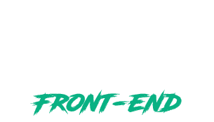
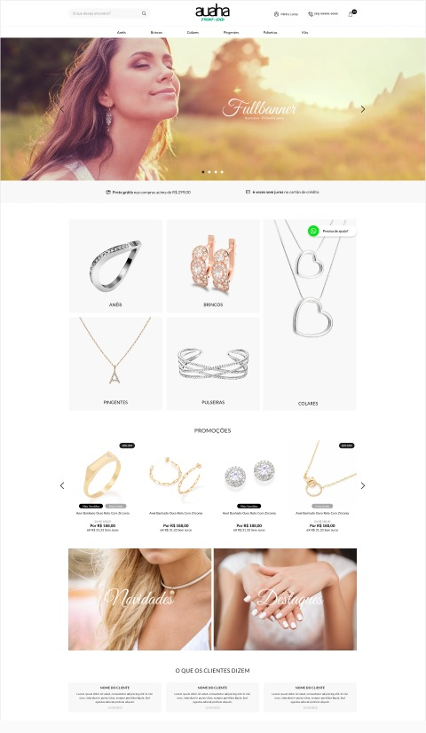
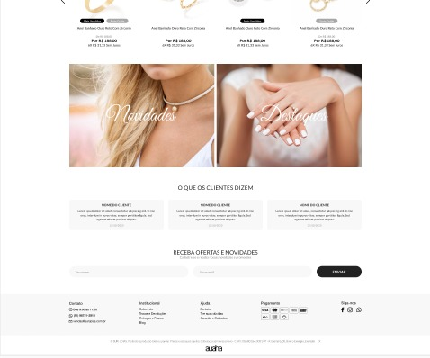

<p align="center">
  
</p>

<p align="center">
  
  
  
</p>
<br>

# Documentação

## Tecnologias

Esse projeto foi desenvolvido com as seguintes tecnologias:

- [Node.js](https://nodejs.org/en/)
- [React](https://reactjs.org)
- [SASS](https://sass-lang.com/)

## Deploy do projeto

##### Link de acesso: http://auaha.site/

## Como executar

#### Como rodar o projeto

```bash
# Instalar as dependências
$ npm install
# Iniciar o projeto
$ npm start
```

O app estará disponível no seu browser pelo endereço http://localhost:3000.

## Layout

<p align="center">
    
    
</p>
